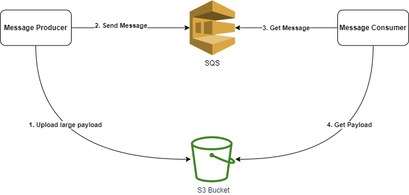

# SQS Memory Limit Workaround

This is based on the following article, **which has served as a base repo to show how to woraround the SQS memory limitation** [SQS Memory Limit Workaround 🚀](https://medium.com/@tshepomakhubela/sqs-memory-limit-workaround-3542bf29549c)

## Getting started

To get started, you can run the following commands from the root directory:

**Note: This will incur costs in your AWS account which you should account for.**

`npm i`

`npm run deploy --stage develop`

This will install the dependencies for the project and deploy the project to AWS.

> To remove the project you can run: npm run remove --stage develop